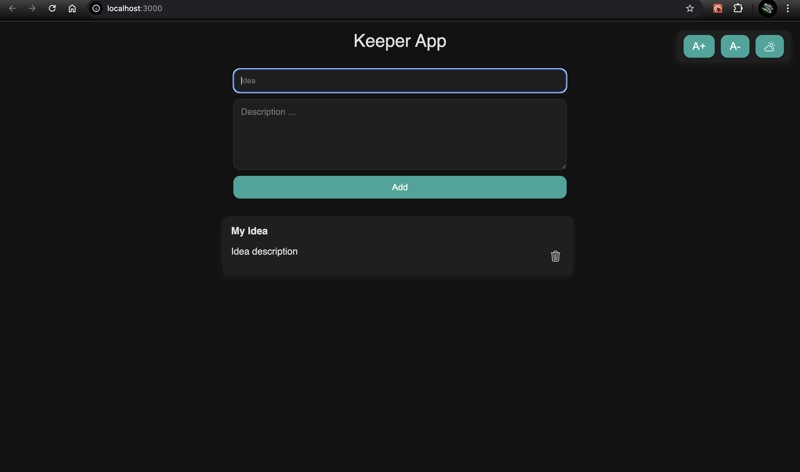
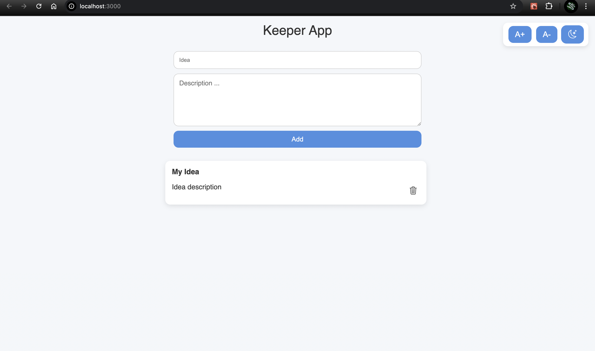
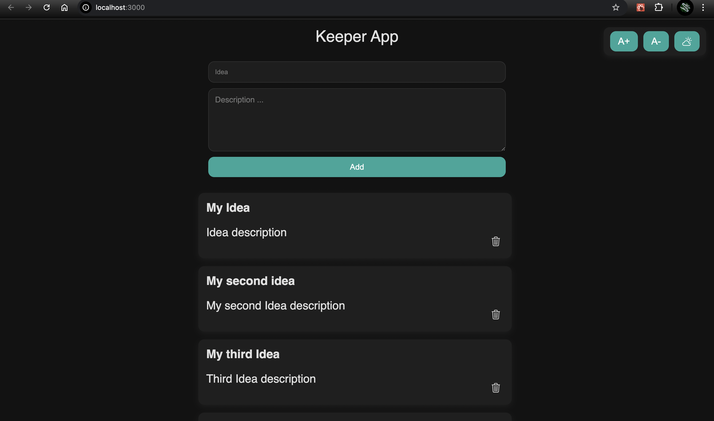
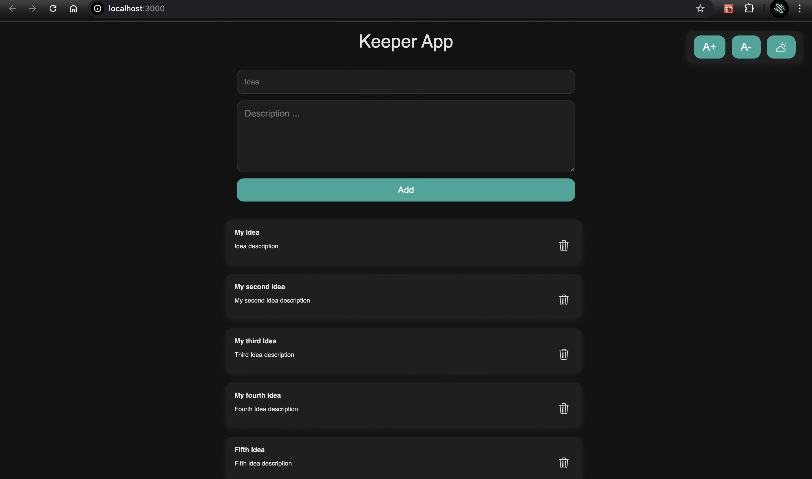

# 📝 Keeper App

A clean and functional note-taking app built with **React**, designed to help users save their ideas and important thoughts conveniently. This app is inspired by the classic "Google Keep" layout, enhanced with **dynamic font resizing** and a **dark/light theme switcher**.

## 🚀 Features

- ✅ Add and delete notes dynamically  
- 🌙 Toggle between **light** and **dark** (night vision) modes  
- 🔠 Increase or decrease font size with A+ / A- buttons  
- 🎯 Keyboard shortcuts:
  - Press `Enter` in the idea input to move to the description
  - Press `Enter` in the description box to add the note directly  
- ♻️ Real-time updates without refreshing the page

---

## 🛠️ Built With

- **React.js** (Functional Components + Hooks)
- **useState**, **useEffect**, and **useRef**
- **Props drilling** for component communication
- **Bootstrap Icons**
- Custom **CSS styling** for theme and layout control

---

## 🧠 Skills Demonstrated

- 🔧 Component-based architecture (`App`, `Header`, `InputBox`, `Card`, `ThemeBox`)
- 📦 State management using `useState` for dynamic UI updates
- 📡 Lifting state up and passing props between components
- 🎨 Dynamic inline styling with React (`fontSize` adjustments)
- 🎮 Event handling (click, keypress, focus with `useRef`)
- 💡 Controlled components for form inputs
- 🌗 Theme switching using `useEffect`
- 🚀 DOM manipulation through React instead of vanilla JS

---

## 🖥️ Getting Started

To run this project locally:


# Clone the repository
```bash
git clone https://github.com/yourusername/keeper-app.git
```

# Navigate into the project directory
```bash
cd keeper-app
```

# Install dependencies
```bash
npm install
```

# Start the app
```bash
npm start
```

**Then open http://localhost:3000 to view it in your browser.**

### 🧑‍💻 Author
*Pawan Sanklapa*
- Passionate about building user-friendly and dynamic React applications.

### Sreenshots

----

---

---

---
